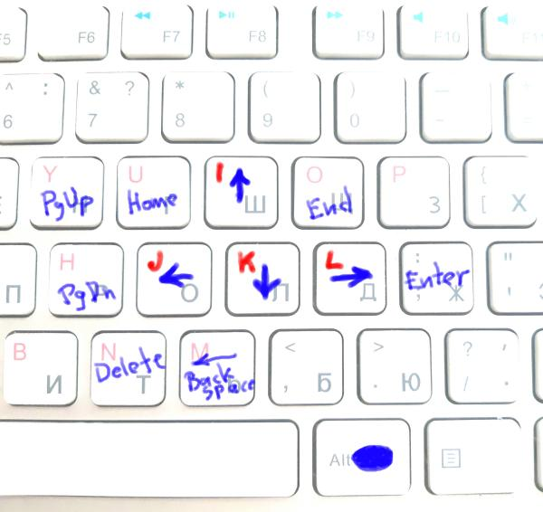

# JKIL Arrows

```
  I        ↑
J K L    ← ↓ →
```



### Cursor on `JKIL` keys.

Once you tried to use `jkil` instead of cursor keys (notice - these keys compose the same pyramid as you used to) - it is impossible to go back. It is invaluable when you don't have to take your right hand off the touch typing position to navigate a cursor. Just use `Right Alt` (or `Right ⌘`) with `jkil` and move a cursor.

This project contains a set of configs for different OSs to setup `jkil` cursor that will work in ANY application (explorer, finder, browser, your IDE). So you don't have to rely on application's inner cursor crafts (VIM, etc.), instead, you use `jkil` consistently across any application.

* navigate cursor without leaving your typing position
* press `Enter`, `Delete`, and other without leaving your typing position
* consistent cursor hot-keys across all applications, system-wide
* additional keys difficult to reach or absent on some keyboards (`PgUp`, `PgDown`, `Home`, `End`, `Delete`, `Remove`, `Enter`)
* works with `Shift`, `Ctrl`, etc.

Press `Right Alt` (`Right ⌘`) plus...
* `RAlt + jkil` - left, down, up, right
* `RAlt + ;` - Enter
* `RAlt + u` - Line start
* `RAlt + p` - Line end
* `RAlt + y` - PgUp
* `RAlt + h` - PgDown
* `RAlt + m` - Remove
* `RAlt + n` - Delete


