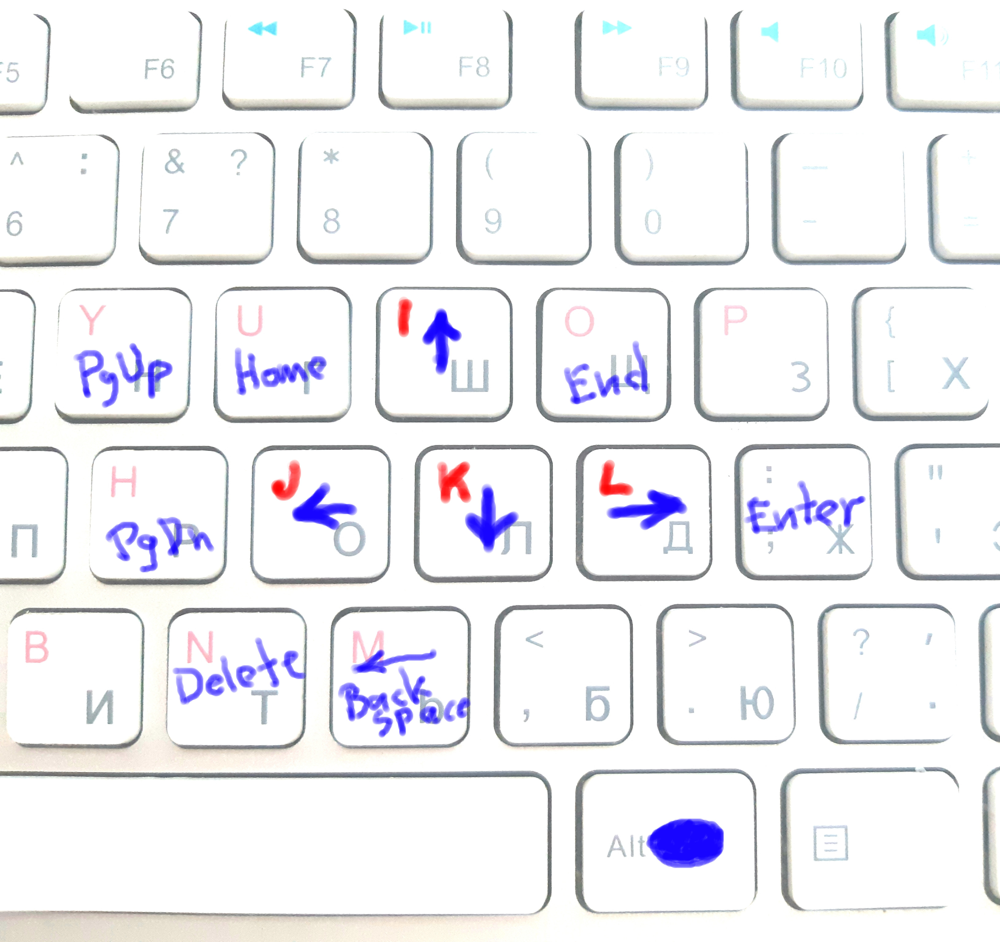

# JKIL Arrows (linux)

```
  I        ↑
J K L    ← ↓ →
```

The currently working solution is to implement the mapping [via xkb](xkb).

Previously, [I was using](autokey) AutoKey to map `jkil` to arrows. But it has several drawbacks. First, AutoKey does not distinguish between left and right `Alt`, which led to some hacks needed to keep some hotkeys available (`ctrl+alt+l`, for example). Second, AutoKey sometimes just slows down and freezes, which is a no-go.



