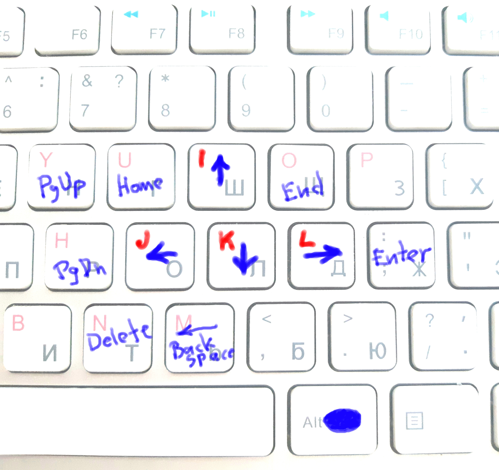

# JKIL Arrows (MAC)

```
  I        ↑
J K L    ← ↓ →
```



In this doc only the difference (Mac specific) with [the main concept](../README.md) is described.

Mapping of `[Right Command ⌘] + ijkl` to the cursor keys.

1. Install (Karabiner)[https://pqrs.org/osx/karabiner/]
1. Replace this karabiner.json at `[home]/.config/karabiner/`

In contrast with Win/Linux versions, remaps `⌘+u` to `⌘+left`, and `⌘+o` to `⌘+right` (navigate to start/end of the string). This is because `⌘+left/right` in Mac works the same way as `Home/End` in Win/Linux. And as moving a cursor to start/end of the line is a more frequent action than scroll to the start/end of the document - it is done this way here too.